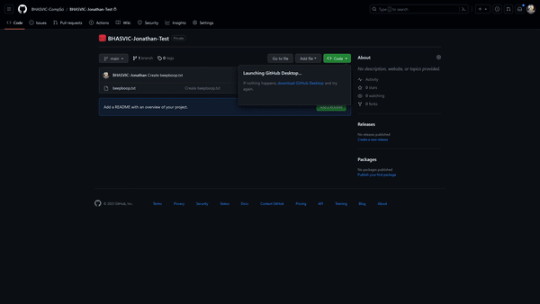

*[Home](../README.md) > [Checking Out](checkingOut.md)*

---

## Cloning

### What this is for
Cloning gives you a copy of your repository on the computer you're using. You'll use it the first time you download your project on a new machine in college or at home.

### What to do
1. Open the github site and navigate to the repository you've created in our organisation
2. Click the green code<> button and then download with github desktop, your browser might ask you if it's ok to open it first
3. Follow the prompt in github desktop - make sure to pick an appropriate folder within your user documents so it's stored within your windows account and not accessible to others using the PC

