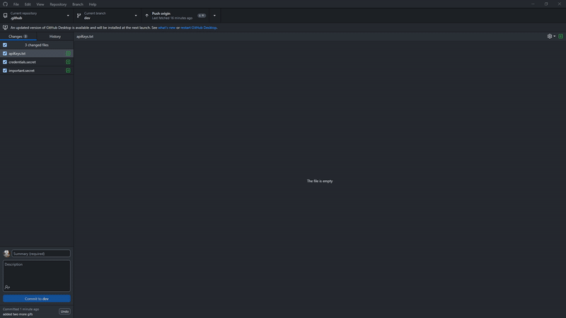

*[Home](../README.md) > [gitignore](./gitignore.md)*

## gitignore

### What this is for

Gitignore means that when you submit your project github will ignore some files. These aren't needed as they're often temporary files your computer generates each time your code is run. 

By ignoring these your project will still work but it saves a lot of time when pushing or pulling your project.

### What to do
Ideally you'll have made this when making your repository. If not you can add it in later on to an existing project if you're experiencing issues.

A `.gitignore` file is a plain text file where each line contains a pattern for files/directories to ignore. Generally, this is placed in the root folder of the repository.

An example of a `.gitignore` file:

```
# Ignore node_modules folder
node_modules

# Ignore all .log files
*.log

# Ignore all .txt files in the doc/ directory
doc/*.txt
```

For people using unity for their projects, you should use githubs built in unity gitignore file. You can find it [here](https://github.com/github/gitignore/blob/main/Unity.gitignore).

## Tutorials




#### Youtube video:
[](https://www.youtube.com/watch?v=0WfDe51pUU0)