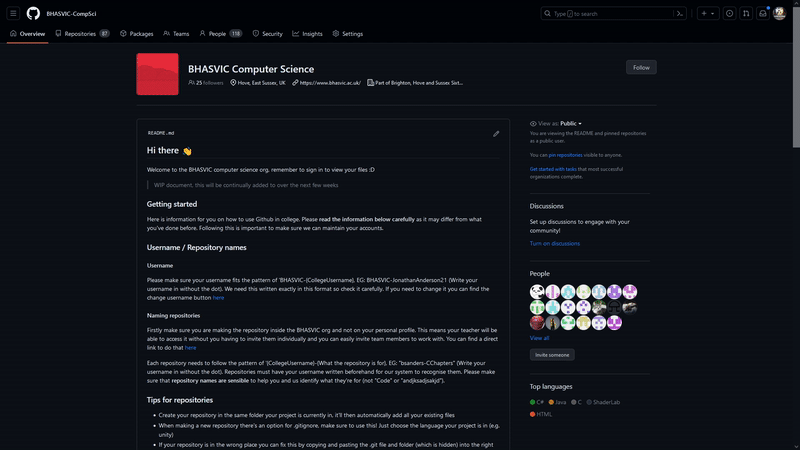

[Home](../README.md) > [Making a Repository](makingRepo.md)

# Making a Repository

## What is a Repository?
A repository is where you store your code. You can upload entire projects in one place and it'll keep your file and folder structure. This means you can access it in multiple places.

When setting up a repository you can tailor it towards a particular language or framework (e.g. Unity) which means it will avoid some system files you don't need. This makes it a lot simpler than using something like onedrive.

Follow this guide carefully to help you make your repository. You'll only need to do this once at the start of a new project.

## Creating a Repository on GitHub

1. To create a repository in the BHASVIC organization, use the green "New" button on the [BHASVIC organization reposoitory page](https://github.com/orgs/BHASVIC-CompSci/repositories). The repository name should be the your username followed by the name of your project. EG
    
    MichealAngelo23-NewProject

## Tutorial

