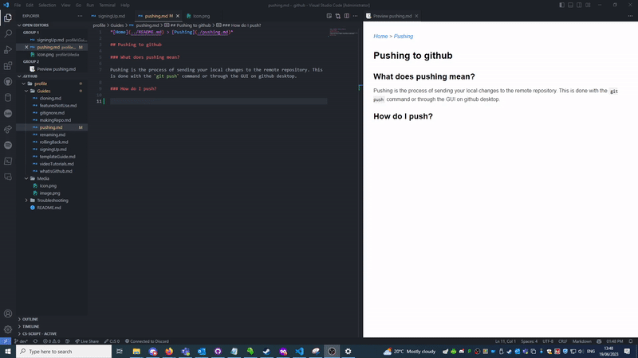

*[Home](https://github.com/BHASVIC-CompSci/.github/blob/main/profile/README.md) > [Pushing](./pushing.md)*

## Pushing to github

### What does pushing mean?

Pushing is the process of sending your local changes to the remote repository. This means that your changes are now available to everyone else and you can access them from any device.

### How do I push?
1. Open github desktop and select the repository you're working on from the top left
2. You'll see all your changes on the screen, with all the files that are going to be pushed on the left hand side
3. Fill in the commit box on the left hand side with sensible summary and description, you'll be relying on it later. Then click commit
4. Press push on the right hand side of the bar at the top

### Video Guide

