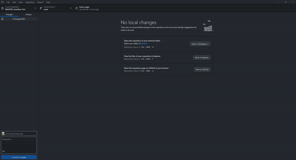

*[Home](https://github.com/BHASVIC-CompSci/.github/blob/main/profile/README.md) > [Rolling Back](./rollingBack.md)*

---

## Rolling Back

### What this is for
If you want to access a previous version of your code you can get access to any previous commit you've done. This can then be pulled and work on on your computer.

This won't override your existing version so you could use it to find some code you accidentally deleted, part of your coursework you wanted to visit again or undo a change you've made that broke your code.

### What to do
1. Open the repository on github desktop
2. Click the history button on the top bar
3. Find the commit you want to go back to and click the arrow on the right hand side
4. Click revert changes in this commit

