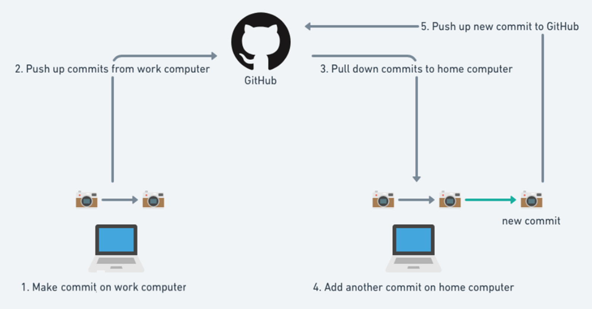

*[Home](../README.md) > [Signing Up](./signingUp.md)*

---

## What is github

### Manages coding projects
Github is used by many businesses to manage coding projects. There are many tools we won't use that allowed whole teams of people to all work on the same piece of code seamlessly.

For you it'll be used to manage your own coding projects. Github is designed specifically for this so has less issues than other technology for saving your own such as onedrive. In addition it allows you to store different versions of your work and access previous ones meaning you can find old code if needed.

### Terminology
At the start it can seem overwhelming as there's a lot of new terms to learn. Use this guide to help you understand them and start to get used to it, the process of saving your work is straightforward once you're used to it.

The main terms you'll need are:
- Pushing - Uploading your work
- Pulling - Getting the latest version of your work
- Cloning - Making a copy of your work
- Repository - The project you're working on, both stored locally (on each machine you're working on) and remotely (on github)

### Benefits
- Designed to save code for all sorts of projects
- Gives you good experience for industry
- Let's you see a history of all the versions of code you've made so far

### Downsides
- Takes a little bit of time to learn how to use it
- It doesn't automatically sync like one drive, you need to remember to push and pull your work each time

### What to do next
Read the guides here to get started, if you need help use the github help channel on Teams